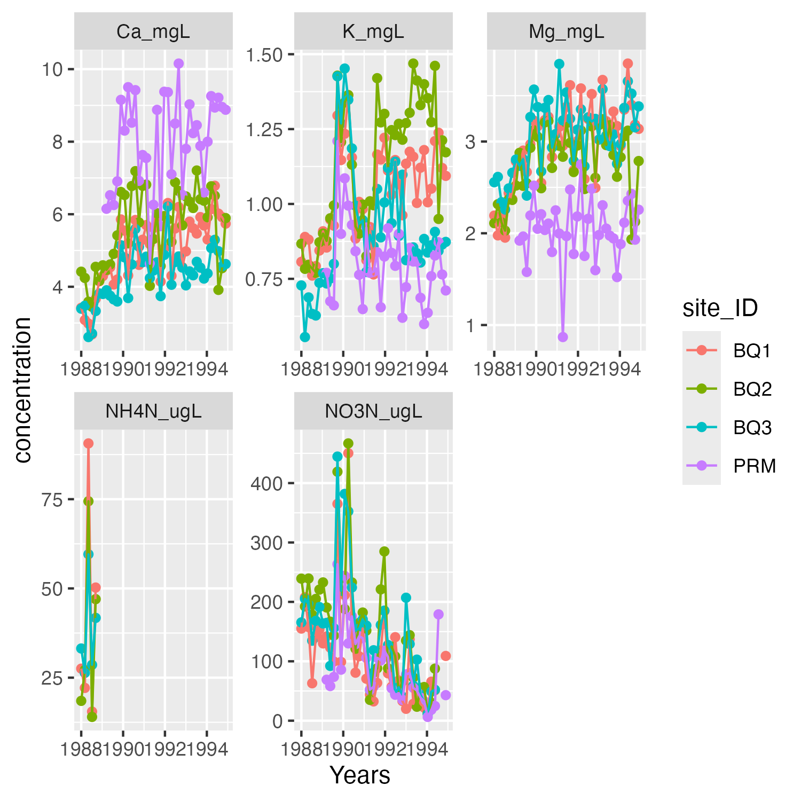

# Stream Chemistry Changes Pre and Post Hurricane Hugo

## Background
The goal of this analysis is to approximate Figure 3 from [Schaefer et al. (2000)](https://github.com/pr-scilla/pap214final/blob/main/README.md), which shows stream chemistry changes at four Puerto Rican stream sample sites pre and post Hurricane Hugo.

Hurricane Hugo made landfall on Puerto Rico in late September of 1989. This analysis shows 9 week moving average concentrations of potassium (K_mgL),  nitrate-N (NO3N_ugL), magnesium (Mg_mgL), calcium (Ca_mgL) and ammonium-N (NH4N_ugL) between January 1, 1988 and December 31, 1994 at the following sample sites:

- Bisley Quebrada Cuenca 1 (BQ1)

- Bisley Quebrada Cuenca 2 (BQ2)

- Bisley Quebrada Cuenca 3 (BQ3)

- Puente Roto Rio Mameyes (PRM)

## Data
Raw water chemistry data .csv files were sourced from [McDowell and International Institute Of Tropical Forestry (IITF) (2024)](https://github.com/pr-scilla/pap214final/blob/main/README.md).

## Methods
Water chemistry data for the sample sites were processed as follows: 

- Data for each site were processed to only include readings for the five ions of interest in this analysis. 

- Moving averages for each ion of interest were calculated for each site for every 9 weeks during the sampling period (January 1, 1988 through December 31, 1994). The moving_average() function was created to automate this step.

- Data for each site were joined together into one data frame.

## Results
Water chemistry moving averages for the period of interest were plotted for each site.

Average concentrations for each ion are displayed in separate graphs.

The product of this analysis suggests that the ammonium-N (NH4N_ugL) concentration data from late 1988 through the end of the sampling period of interest are missing from the raw data files.



```{r}
library(tidyverse)

# Read cleaned and analyzed data for four sample sites
Figure_3_Reproduction <- read_csv("../output/figure-3-reproduction-data.csv")

# Plot data to approximate original Figure 3 from Schaefer et al. (2000)
ggplot(
  data = Figure_3_Reproduction,
  mapping = aes(
    x = window_start,
    y = concentration,
    color = site_ID
  )
) +
  geom_line() +
  labs(x = "Years", y = "Ion Concentration", color = "Site ID") +
  theme(legend.justification = c("right", "top")) +
  facet_grid(
    vars(fct_relevel(
      as_factor(Figure_3_Reproduction$ion),
      "K_mgL",
      "NO3N_ugL",
      "Mg_mgL",
      "Ca_mgL",
      "NH4N_ugL" # Reorganize ions to display graphs in same order as Figure 3
    )),
    scales = "free",
    switch = "y"
  )
# Save plot as an image
ggsave("../figs/figure-3-reproduction.png")
```